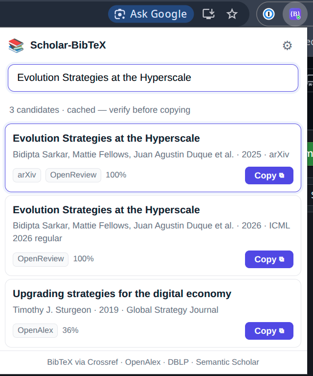

# Scholar-BibTeX

A minimal-permission Chrome (Chromium) MV3 extension that produces **trustworthy
BibTeX** — without ever touching Google Scholar's rate-limited `output=cite`
endpoint. Citation data comes from open scholarly sources (**Crossref, OpenAlex,
DBLP, Semantic Scholar, arXiv, OpenReview, CVF Open Access**) on different origins, so Scholar's rate-limiter is
irrelevant.

<p align="center">
  
</p>

Two surfaces:

- **Inline** — a `BibTeX ⧉` button injected next to each Scholar result. When the
  page already gives us title + authors + year, the match is high-confidence and
  copies instantly (`copied · via Crossref`). If it's ambiguous, a small picker
  panel drops under the button so **you** commit the choice.
- **Popup** — a paste-anything box. Drop in a DOI, arXiv id, URL, or title and
  pick from candidate cards. Keeps a re-copyable recents list.

The guiding rule: **a wrong citation is worse than no citation.** The extension
never silently trusts a fuzzy title match — it always offers the top candidates,
pre-highlights the best, and lets a human commit.

## Install (load unpacked)

1. Open `chrome://extensions`.
2. Enable **Developer mode** (top-right).
3. **Load unpacked** → select this repository's directory (the one with `manifest.json`).
4. Pin the icon. Go to `scholar.google.com`, or click the icon to paste a query.

## How it works

```
content/scholar.js ─┐   ┌─ popup/popup.js ─┐
 parse + inject,    │   │ smart input box, │
 toast / picker     │   │ candidate cards  │
└────────┬──────────┘   └────────┬──────────┘
         │  chrome.runtime.sendMessage(...)
         └──────────────┬────────┘
                        ▼
       background.js (service worker, module)
        • classify input          • cache + recents (storage)
        • search (Crossref ∥ …)   • rate-limit-aware chain
        • rank / merge / dedupe   • cite-key normalization
        • fetch BibTeX (DOI → …)
```

Everything routes through the background worker: it holds the `host_permissions`,
centralizes caching, and keeps both surfaces thin (they only parse + render and
never call APIs directly).

### The resolver pipeline (`src/resolver/`)

1. **Classify** (`classify.js`) — DOI → arXiv → OpenReview/CVF URL → title.
2. **Exact path** — content-negotiate `https://doi.org/<doi>` with
   `Accept: application/x-bibtex`. arXiv ids map to `10.48550/arXiv.<id>`.
   OpenReview forum ids and CVF Open Access paper URLs (`thecvf.js`) skip
   content-negotiation entirely: each page embeds a ready-made BibTeX block we
   extract directly. CVF has no search API, so it's URL-only (paste/follow a
   `openaccess.thecvf.com` paper or PDF link).
3. **Title search** (`crossref.js`, `openalex.js`) — Crossref
   `query.bibliographic` ∥ OpenAlex `search`, top ~5 each. DBLP + Semantic
   Scholar are pulled in automatically when the top result isn't corroborated by
   ≥2 independent sources.
4. **Rank & merge** (`rank.js`) — normalize titles (ascii-fold, lowercase, strip
   punctuation), score via a blend of token-Jaccard and normalized Levenshtein,
   dedupe by DOI, give a small boost when sources agree, return the top 2–3.
5. **BibTeX** (`bibtex.js`) — DOI content-negotiation → DBLP key → DBLP-by-DOI →
   Semantic Scholar `citationStyles` → construct. The cite key is rewritten from
   metadata parsed out of the returned BibTeX (`vaswani2017attention`, not
   `https://doi.org/10.48550/arxiv…`). Toggle between **nice** and **raw** keys
   in the popup settings.

Every result is tagged with a **source badge** so you can trace where the BibTeX
came from.

## Run the tests

Pure, risk-bearing functions are unit-tested with Node's built-in runner — no
network, no build tooling.

```bash
npm test            # node --test tests/*.test.js
```

The unit tests cover classification, title normalization & scoring, cite-key
generation, BibTeX field parsing, and per-source response parsing.

## Project layout

```
scholar-bibtex/
├── manifest.json
├── package.json                # type: module + test script
├── src/
│   ├── background.js           # module service worker — message router + cache
│   ├── resolver/{classify,crossref,openalex,dblp,semanticscholar,arxiv,openreview,thecvf,bibtex,rank,index}.js
│   ├── content/{scholar.js,scholar.css}      # self-contained, messaging-only
│   ├── popup/{popup.html,popup.js,popup.css} # <script type="module">
│   └── lib/{storage.js,messaging.js}
├── icons/{16,32,48,128}.png (+ icon.svg)
└── tests/                      # node --test
```

Zero build tooling: the background worker uses `"type": "module"`, the popup uses
`<script type="module">`, and the content script is a single file that only talks
via messaging.

## Settings (popup → ⚙)

- **Cite-key style** — `nice` (`vaswani2017attention`) or `raw` (as returned).
- **Polite email** — appended to Crossref/OpenAlex calls for the faster polite
  pool. Optional.
- **Auto-copy Scholar matches** — when on, high-confidence inline matches copy
  immediately; turn off to always show the picker.

## Privacy

The extension collects and stores **nothing** on our servers — caching and
recents live in local `chrome.storage`. But to retrieve citations, **paper
titles, DOIs, arXiv ids, OpenReview forum ids, and CVF Open Access paper URLs you
look up are sent to Crossref, OpenAlex, DBLP, Semantic Scholar, arXiv,
OpenReview, and openaccess.thecvf.com**. Permissions are kept narrow (no `tabs`,
no `<all_urls>`) for a light Web Store review.

## Status & follow-ups

- MVP targets `scholar.google.com`; regional Scholar TLDs (`.de`, `.co.uk`, …)
  can be added by extending the content-script `matches`.
- Semantic Scholar occasionally returns `429` without an API key; it degrades
  gracefully (the other sources still answer).
